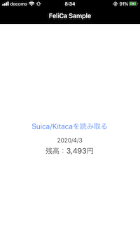
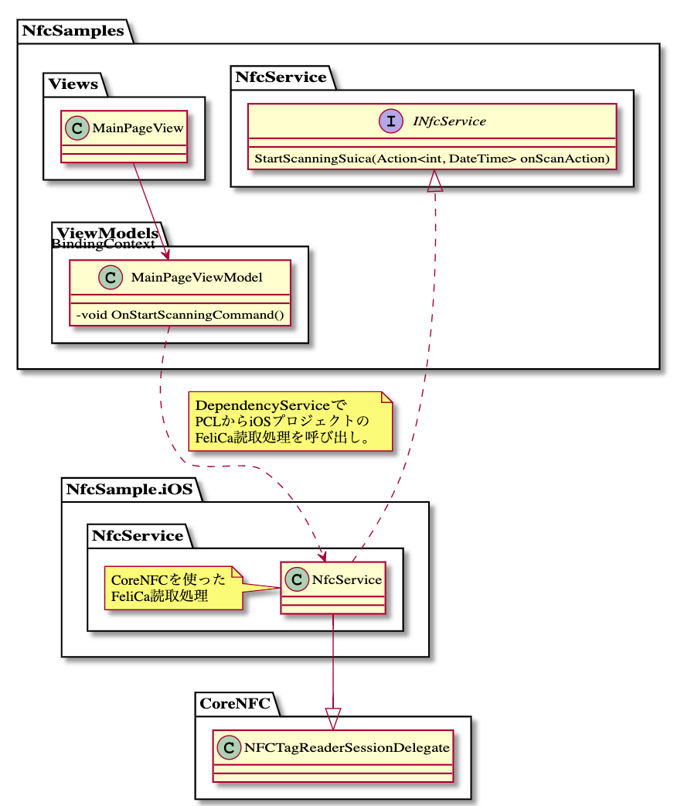

# Xamarin.FormsでFeliCaにアクセスするサンプル

## できること

Suica/Kitacaの残高を表示できます。

## 画面イメージ

起動直後


読取待ち


カード検知


読み取った残高の表示



失敗時


## クラス構成



<details>
<summary>PlantUMLコード</summary>

```plantuml

skinparam classAttributeIconSize 0

namespace NfcSamples  {

    namespace Views{
        class MainPageView
    }

    namespace ViewModels{
        class MainPageViewModel{
            - void OnStartScanningCommand()
        }
    }

    NfcSamples.Views.MainPageView --> "BindingContext" NfcSamples.ViewModels.MainPageViewModel

    namespace NfcService{
        interface INfcService{
            StartScanningSuica(Action<int, DateTime> onScanAction)
        }
    }
}

namespace NfcSample.iOS {

    namespace NfcService{
        class NfcService 

        NfcService --|> CoreNFC.NFCTagReaderSessionDelegate

        note left of NfcService
            CoreNFCを使った
            FeliCa読取処理 
        end note
    }
}

NfcSamples.ViewModels.MainPageViewModel ..> NfcSample.iOS.NfcService.NfcService 
note right on link 
    DependencyServiceで
    PCLからiOSプロジェクトの
    FeliCa読取処理を呼び出し。
end note

NfcSample.iOS.NfcService.NfcService ..|> NfcSamples.NfcService.INfcService

```

</details>